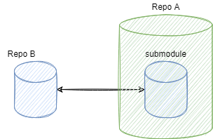

## 参考gitlab的目录结构

https://about.gitlab.com/images/press/git-cheat-sheet.pdf

## 5个位置

`Stash` <-->  `Workspace` <--> `Index` <--> `Local Repository` <--> `Upstream Repository`

## 01 安装git后的第一次配置

**using ssh**

修改当前仓库的config文件中的url

```
#url = https://github.com/xuechou/interpreter.git
url = git@github.com:xuechou/interpreter.git
```

## 02 新建或者克隆git仓库

**递归克隆仓库，针对包含sub-module的仓库**

- git clone --recurse-submodules *url*


## 03 日常工作,使用的最多

**检查已修改内容**

- git status

**撤销所有修改，回到HEAD版本,并且删除untracked file,此方法可以保证workspace clean**

- git reset --hard HEAD
- git clean -df -x ./

**新增提交**

- git add *
- git commit -m "balabala"

**删除提交中的某个文件**

- git restore --staged *someFile*

**追加提交,或者修改当前提交的Log**

- git commit --amend

## 04 分支模型

**列出所有分支**

- git branch -a

## 05 查看日志

`git log -1` 查看最近1次的提交记录

`git log -1 --name-status` 显示最近提交的文件变更列表

`git log --author=xxx` 只查看某个人的提交

## 08 仓库间的同步

**建议push之前，先进行rebase操作，避免push失败**

- git fetch
- git rebase
- 解决合并中*冲突的文件*
- git add  *冲突的文件*
- git rebase --continue

- `git push origin master:master`

## 10 仓库中引用另一个仓库——git子模块，submudule

**怎么给仓库中添加一个新的submodule?**

- git submodule add *url*

**如何克隆含submodule的代码仓库?**

简单，克隆时加选项`--recurse-submodules`

- git clone --recurse-submodules *url* *set_path_for_summodule*

**远程的子模块更新后，如何更新本地仓库的子模块?**

- git submodule update --remote   `拉取子模块的更新到本地仓库，还需要提交一次才能在远程仓库生效`
- git status; git add *; git commit -m "xx"; git push;

**只想更新其中一个子模块，怎么做?**

- 切换到子模块的目录；
- 如果是clean的，直接`git pull`

**想查看某个子模块更改啥?**

直接`git status`只能看到submodule这个文件变成`dirty`; 

得切换到submodule队友的目录下，然后`git status`

**如何保持workspace clean，包括子模块也是clean?**

```git
git clean -xfd
git submodule foreach --recursive git clean -xfd
git reset --hard
git submodule foreach --recursive git reset --hard
git submodule update --init --recursive
```
**在如何推送子模块的更改?——在包含子模块的仓库中，**

假设存在仓库A和B，并且仓库A中使用submodule来引用仓库B。

- **思路**——直接在`主仓库A`中，先push所有的子模块，最后再推送主仓库A；

    - 在主仓库中，切换到子模块的路径，这时候`git status`是可以看到当前分支，且**不是**处于游离状态；
    - 然后就是三步:`git add *; git commit -m "balabals ..."; git push origin master:master;`
    - 最后，所有子模块的改动都推送后，最后推送主模块A；


## FAQ